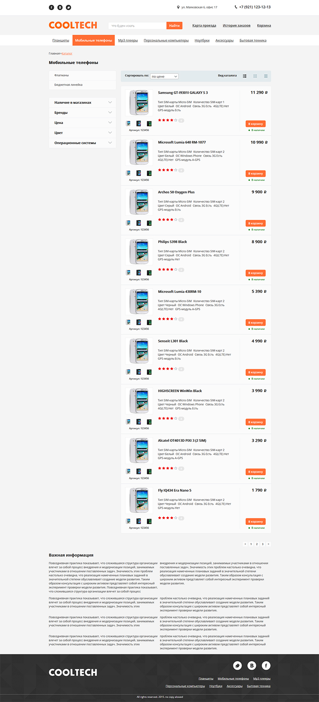
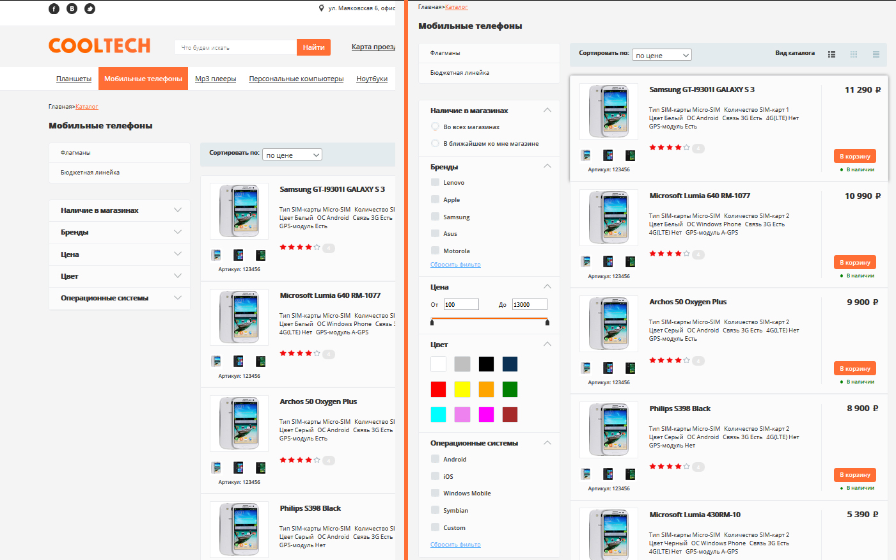
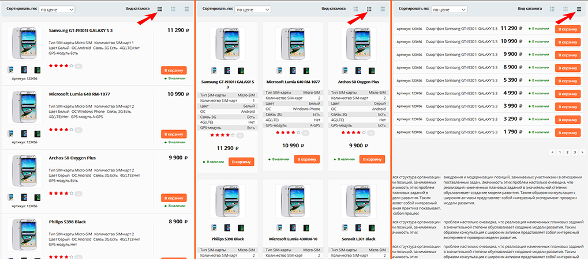

# Страничка интернет магазина

На страничке представлен каталог телефонов и аккордеон с фильтрами для отбора товаров.

## Аккордеон

  

Аккордеон содержит фильтры для отбора товаров, такие как:

*   Наличие в магазинах
*   Бренды
*   Цена
*   Цвет
*   Операционные системы

## Система сеток

Нажав на одну из иконок можно изменить вид каталога

  

## Библиотеки используемые для этого проекта:

*   jQuery
*   jQuery-UI
*   jQuery.columnizer
*   Normalize-css
*   Select2

## Как скачать проект

Перед тем как скачать проект убедитесь, что у вас установлены

*   [Node.js](https://nodejs.org/)
*   [NPM](https://www.npmjs.com/)
*   [Bower](http://bower.io/)
*   [Gulp](http://gulpjs.com/)

### Скачивание

В терминале перейдите в папку в которую будет скачиваться проект. После чего наберите команды

*   git clone https://github.com/AlexeyErofeyev/LoftShop.git
*   cd LoftShop
*   npm install
*   bower install
*   gulp

Проект сам запустится и откроется в браузере